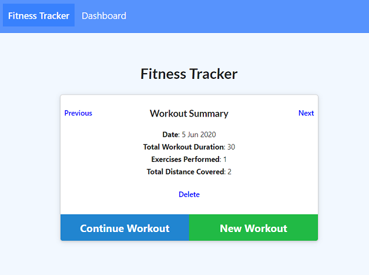
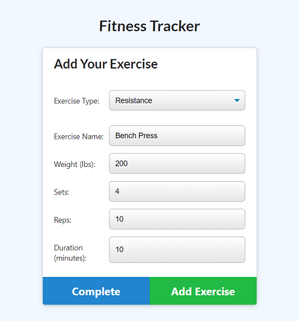
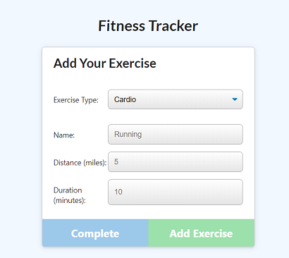
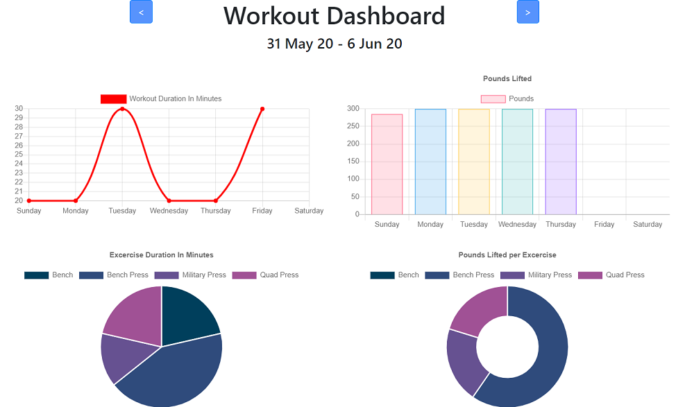

# Fitness Tracker

## Description 

 
 

The fitness tracker application tracks your workout progress to help you reach your fitness goals faster. Users can log multiple exercises in a workout on any given day. They can then view, create and track daily workouts. The application also generates workout progress charts based on the workouts entered.  

*The application is deployed on Heroku at the below link:*

[Fitness Tracker - https://gveetil-fitness-tracker.herokuapp.com/](https://gveetil-fitness-tracker.herokuapp.com/)
 
 

## Table of Contents 

- [Technical Features](#technical-features)
 - [Heroku Deployment](#heroku-deployment)
 - [MVC](#mvc)
- [Usage Guidelines](#usage-guidelines)

 

## Technical Features
This application is powered by Node.js, uses an express backend server and is currently hosted on Heroku. It uses mongo as the database, and mongoose as the ORM to access this database.  

### Heroku Deployment
The fitness tracker application is currently deployed on Heroku and uses mLab to host the backend mongo database. 

### MVC 
This application follows the Model View Controller(MVC) architectural pattern. Using the MVC pattern helps modularize the application by separating the user interface, the business logic, and the data access logic into different components. This in turn increases flexibility, maintainability and scalability of the application.

## Usage Guidelines

When the fitness tracker application is opened, by default it loads up the last workout entered in the system and displays the below page:  

   

* Here users can view details of the workouts in the system. 
* To view the previous workout / date, click the previous button.
* To view the next workout / date, click the next button.
* To delete a workout, click the delete button. This will remove that workout from the system and display a success message.
* To add more exercises to an existing workout, click the `Continue Workout` button.
* To start a new workout click the `New Workout` button. This will automatically add a new workout for the selected date and display the add exercise screen:  

   

 * To add an exercise of type `Resistance`, select the corresponding type from the drop down list, and enter the exercise name and measurements.

 * To add an exercise of type `Cardio`, select the corresponding type from the drop down list. This will bring up the below form:
 
   

 * Once all fields are entered correctly (all measurements have to be numeric) - the `Complete` and `Add Exercise` buttons are enabled.
 * To save the exercise and add another exercise to the workout - click the `Add Exercise` button. 
 * To save the exercise and return to the home page, click the `Complete` button. 
 * If the exercise was saved successfully, a toast message is displyed to notify the user of the same.
 * If the exercise data was incorrect - e.g. if a measurement is too large, etc. An error message is displayed.  
 
 Once the workouts have been entered, users can then view the workout summary charts by clicking on the Dashboard menu:   
  
   

* To view a summary of the data from the previous week, click the previous button
* To view a summary of the forecast data for the next week, click the next button